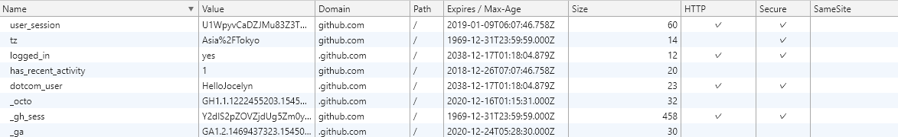

## Cookie

### 概念：用来（长时间存储数据）存储数据。

1.	cookie存储以域名方式分隔；
2.	cookie数据可以设置名字，值，域名，path,过期时间，大小等
3.	同一个域名下cookie个数有限。不同浏览器个数限制不同。Firefox为50个，Safari/Webkit貌似没有限制。
4.	单个cookie保存的数据大小不能超过4K。
5.	每种浏览器cookie存储文件地址不一样。chrome地址为%LOCALAPPDATA%/Google/Chrome/User Data/Default/下的Cookie文件。
### cookie属性详解：
* Name:
* Value:
* Domain: 域，表示当前cookie所属于哪个域或子域下面。对于服务器返回的Set-Cookie中，如果没有指定Domain的值，那么其Domain的值是默认为当前所提交的http的请求所对应的主域名的。比如访问 ```http://www.example.com```，返回一个cookie，没有指名domain值，那么其为值为默认的```www.example.com```。
* Path: 表示cookie的所属路径
* Expires/Max-Age: 表示了cookie的有效期。expire的值，是一个时间，过了这个时间，该cookie就失效了。或者是用max-age指定当前cookie是在多长时间之后而失效。如果服务器返回的一个cookie，没有指定其expire time，那么表明此cookie有效期只是当前的session，即是session cookie，当前session会话结束后，就过期了。对应的，当关闭（浏览器中）该页面的时候，此cookie就应该被浏览器所删除了。
* Size: 大小
* HTTP: 表示此cookie必须用于http或https传输。这意味着，浏览器脚本，比如javascript中，是不允许访问操作此cookie的。
* Secure: 表示该cookie只能用https传输。一般用于包含认证信息的cookie，要求传输此cookie的时候，必须用https传输。
* SameSite: 两个值：Strict（严格的）和Lax（宽松的）。当为严格模式时，表明禁止第三方模式。比如如果天猫页面设置为Strict后，从天猫页面访问淘宝则不是登录状态。

### Cookie的缺陷
* cookie会被附加在每个HTTP请求中，所以无形中增加了流量。
* 由于在HTTP请求中的cookie是明文传递的，所以安全性成问题。（除非用HTTPS)
* Cookie的大小限制在4KB左右。对于复杂的存储需求来说是不够用的。
### cookie存储
每种浏览器cookie存储文件地址不一样。chrome地址为%LOCALAPPDATA%/Google/Chrome/User Data/Default/下的Cookie文件。
打开chrome的Cookie文件，看到是sqllite的数据库文件，使用sqllite database browser打开该数据库文件。可以看到下面数据。

图一：谷歌浏览器查看

图二：sqlite database browser查看


可以看到value数据为空，但是多了个encrypted_value. 浏览器会把比较重要的信息例如自动登录的账号密码以及各种 token 等信息加密存放到此字段中，在发送请求的时候浏览器会将此字段解密，作为请求发给服务器.(然而这个很容易就被人破解，唉)

### 后端实现
增加请求头“Set-Cookie”的方式。
发到浏览器端后，浏览器自动识别set-cookie并存储。
### 前端实现
1.	前端不能直接操作set-cookie


## Session

### 概念
session机制是一种服务器端的机制，服务器使用一种类似于散列表的结构（也可能就是使用散列表）来保存信息。
客户端初次请求服务端，服务端会为客户端创建一个session，并将该sessionId存入客户端cookie中。下次访问可凭此sessionId来获取session。当cookie被禁止时，也可以将sessionId附在url中，或者通过隐式表单实现。
因为session存储在服务器，所以只能服务器才会删除session数据。而浏览器是不会通知服务器去删除的。那么我们通常说的“只要关闭浏览器，session就消失了“又是什么情况呢。这个其实是因为关闭浏览器，存储sessionId的cookie会被删除。则自然无法在服务器上找到对应的session。
###  session的作用
### session的后台实现
### session在服务器间传递


webstorage
	localStorage
	sessionStorage
## 跨域问题
## 服务间共享
